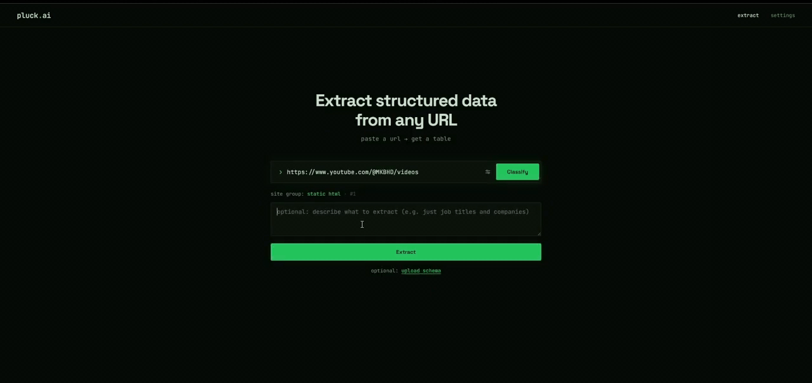

# Pluck

Paste a URL, get back a structured data table. Pluck is a personal web-scraping tool for sites that don't offer data export — job boards, product listings, news aggregators, social profiles. You give it a page and (optionally) a plain-English prompt like "get job listings"; it figures out how to fetch the page, extracts the data, and returns rows and columns you can view in a terminal, a web UI, or save as JSON/CSV. One user, one machine, no accounts.



## Architecture

A request flows through five stages:

1. **Classify.** An initial HTTP probe assigns the URL to one of seven site groups, from plain static HTML up through JavaScript-rendered, interactive-gated, auth-gated, and "fortress" sites (LinkedIn, Instagram, Reddit, YouTube).
2. **Plan.** For Apify-bound sites, a Claude Haiku call reads the user's prompt and picks the best scraper actor and output columns from a registry. Unknown hosts go through discovery: search the Apify Store, rank candidates with Haiku against their live input schemas, and probe the winner once to capture its real output schema.
3. **Fetch.** Standard sites use Scrapling (plain HTTP → headless browser → stealth browser, escalating as needed). Auth-gated and fortress sites run Apify actors in the cloud.
4. **Extract.** Raw HTML is noise-filtered and sent to Haiku for structured extraction. Already-structured data (Apify datasets, intercepted XHR JSON) skips this.
5. **Cache.** SQLite stores plans, discovered actors, and results (bypass with `refresh=true`).

## Quick Start

Windows (PowerShell):

```powershell
python -m venv .venv
.venv\Scripts\activate
pip install -r requirements-api.txt
scrapling install
copy .env.example .env    # then edit .env and add your keys
```

macOS/Linux: same commands, but activate with `source .venv/bin/activate` and copy with `cp .env.example .env`.

Notes:

- `requirements-api.txt` pulls in `requirements.txt`, so this one install covers both the CLI and the API server.
- `scrapling install` downloads browser binaries (several hundred MB). It is required for JavaScript-rendered and stealth fetching (site groups 3–5); classification and plain-HTTP scraping work without it.

## Environment variables

Set these in `.env` (copied from `.env.example`). Names only — never commit values.

| Variable | Required | What it does |
|---|---|---|
| `ANTHROPIC_API_KEY` | Yes | Claude API access for planning and extraction. Get one at [console.anthropic.com](https://console.anthropic.com). |
| `APIFY_TOKEN` | No | Enables auth-gated and fortress sites (LinkedIn, Instagram, Reddit, YouTube...). Get one at [console.apify.com](https://console.apify.com) → Settings → API & Integrations. Without it, those site groups return an error; everything else works. |
| `PLUCK_PASSWORD` | No | Web UI login password. Default: `pluck`. |
| `USE_PLANNER` | No | Intent-aware Apify planner + actor discovery. Default: `true`. Set `false` to use only the legacy classify → fetch → extract path. |
| `LOG_LEVEL` | No | Server logging verbosity: `DEBUG`, `INFO`, `WARNING`, `ERROR`, `CRITICAL`. Default: `INFO`. |

## Running it

### CLI

```powershell
# Classify only — no fetch, no extraction, no API keys needed
python -m pluck.cli https://example.com/ --dry-run

# Full scrape: paste a URL, get a table (requires ANTHROPIC_API_KEY)
python -m pluck.cli https://news.ycombinator.com --auto --max-items 5
```

Useful flags: `--output results.json` / `--output results.csv` to save, `--format table|json|csv`, `--max-items N` to cap rows, `--auto` to skip confirmation prompts, `--verbose` for debug logging.

### API server

```powershell
uvicorn api.main:app --port 8000
```

Health check: http://localhost:8000/api/health. The server serves the web UI at http://localhost:8000 only after the frontend has been built (next section); until then the root path returns 404 and only the API is up.

### Web UI

Requires Node.js. For development (hot reload):

```powershell
cd frontend
npm install
npm run dev
```

Open http://localhost:5173 — API calls are proxied to the backend on port 8000, so run the API server alongside. Log in with `PLUCK_PASSWORD` (default `pluck`).

Alternatively, build once and let the API server serve the UI directly at http://localhost:8000:

```powershell
cd frontend
npm install
npm run build
```

Aside: if you have `make`, `make install` and `make dev` wrap the install and dev-server steps above.

## Tests

```powershell
pip install -r requirements-dev.txt
pytest
```

Expected: **500 passed, 9 deselected**. The 9 deselected are integration tests that hit live services (Apify, Anthropic, real websites); they are excluded by default via `pytest.ini` and require real API keys to run.

## Project structure

```
api/                        FastAPI app
  main.py                   app setup, logging, static frontend mount
  routes.py                 /api/extract SSE pipeline, cache wiring
  auth.py                   password → session-token auth

pluck/                      core library
  cli.py                    terminal entry point
  pipeline.py               classify → fetch → extract → format orchestrator
  config.py                 .env loading and validation
  models.py                 SiteGroup, SiteProfile, FetchResult, ... dataclasses
  ingester.py               initial probe + site profiling
  formatters.py             table / JSON / CSV output
  url_keys.py               cache-key normalization
  classifiers/              seven-group site classifier
  fetchers/                 fetcher router, Scrapling wrappers, Apify handler
  extraction/               noise filter, schema inference, Haiku extractor, JSON repair
  curation/                 prompt → output-column curation
  registry/                 actor registry, planner, discovery planner/filter, output shaper
  storage/                  SQLite cache store (plans, discovered actors, results)

frontend/                   React + Vite web UI (login → URL input → results table)
scripts/                    compile_actor_entry.py — registry-entry compiler
tests/                      unit suite; tests/integration/ = live tests (deselected by default)

Dockerfile                  single-container build (API + built frontend), used by Railway
Makefile                    optional wrappers: install / dev / test / build
requirements.txt            core library deps
requirements-api.txt        + FastAPI/uvicorn (includes requirements.txt — install this one)
requirements-dev.txt        + pytest, pytest-asyncio, respx (for running tests)
```
